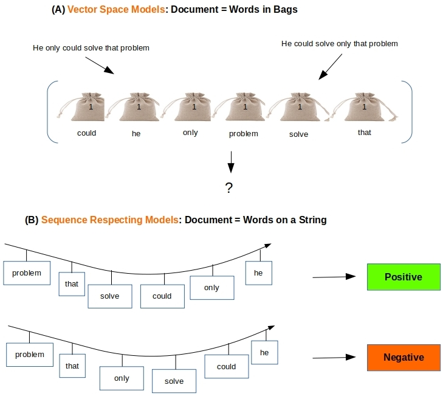
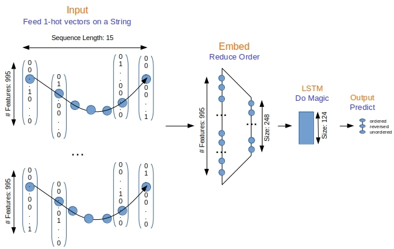

# Word Bags vs Word Sequences for Text Classification
  
This is the source code to go along with the blog article

[Word Bags vs Word Sequences for Text Classification](http://xplordat.com/2018/12/14/want-to-cluster-text-try-custom-word-embeddings/)

The blog illustrates that sequence respecting approaches have an edge over bag-of-words implementations when the said sequence is material to classification. Long Short Term Memory (LSTM) neural nets with words sequences are evaluated against Naive Bayes with tf-idf vectors on a synthetic text corpus for classification effectiveness.

## Dependencies

	numpy
	scikit-learn
	keras
	tensorflow
	matplotlib

## Usage

	mkdir results

###	LSTM

A simple LSTM model is implemented via Keras/Tensorflow

Run it with:
		
	#!/bin/bash
	PYTHONHASHSEED=0 ; pipenv run python lstm.py

To get results like:

###	Naive Bayes

Naive Bayes is implemented via SciKit

	#!/bin/bash
	PYTHONHASHSEED=0 ; pipenv run python nb.py

###	Plot results

			pipenv run python plots.py
			pipenv run python plotConfusionMatrix.py

A comparison of confusion matrices obtained with LSTM and Naive Bayes:
	

